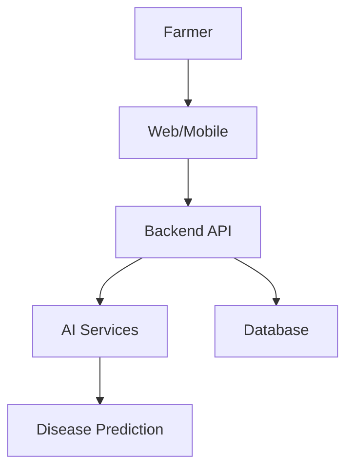

# Agrinova

> AI-powered precision agriculture platform for Africa.

## Overview
Agrinova helps farmers detect crop diseases, monitor crop health, analyze weather, and improve yields using AI, computer vision, and modern web technologies.

## Features
- AI disease detection
- Satellite crop monitoring
- Weather insights
- Yield prediction
- Farm dashboard
- Responsive web app
- Secure authentication
- Analytics

## Tech Stack
- Next.js
- React
- TypeScript
- Tailwind CSS
- FastAPI
- Python
- TensorFlow
- OpenCV
- Supabase
- PostgreSQL

## Project Structure
```text
Agrinova/
├── app/
├── components/
├── ai/
├── backend/
├── public/
├── docs/
├── assets/
├── package.json
└── README.md
```

## Installation
```bash
git clone https://github.com/YOUR_USERNAME/Agrinova.git
cd Agrinova
npm install
npm run dev
```

## Environment Variables
```env
NEXT_PUBLIC_SUPABASE_URL=
NEXT_PUBLIC_SUPABASE_ANON_KEY=
DATABASE_URL=
OPENWEATHER_API_KEY=
```

## Architecture


## AI Pipeline


## Roadmap
- [x] Website
- [x] Dashboard
- [x] AI Detection
- [ ] Mobile App
- [ ] Drone Support
- [ ] IoT Sensors
- [ ] AI Assistant

## Contributing
Fork, create a branch, commit your changes, and open a pull request.

## License
MIT

---
Built with ❤️ for African Agriculture.
