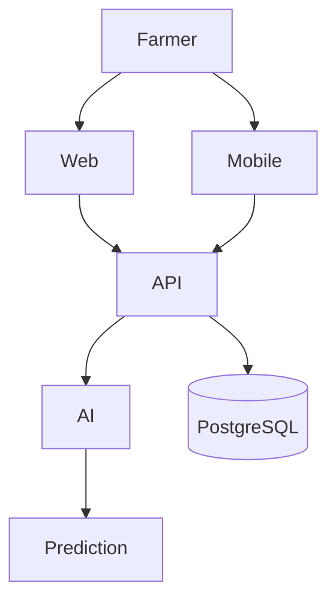

<p align="center">
  
</p>

<h1 align="center">🌿 Agrinova</h1>

<p align="center"><b>AI‑Powered Precision Agriculture Platform</b></p>

<p align="center">


</p>

<p align="center">

</p>

---

# Overview
Agrinova is an AI platform for crop disease detection, satellite crop monitoring, weather insights, analytics, and yield prediction.

## Features

| Icon | Feature |
|---|---|
|  | AI Disease Detection |
|  | Computer Vision |
|  | GPS Mapping |
|  | PostgreSQL |
|  | Supabase Backend |
|  | Docker |

# Screenshots

Replace these placeholders:

```text
assets/screenshots/dashboard.png
assets/screenshots/detection.png
assets/screenshots/mobile.png
```

# Architecture



# AI Pipeline


# Tech Stack

### Frontend


### Backend


### AI


### Database


### DevOps


# Project Structure

```text
Agrinova/
├── app/
├── components/
├── ai/
├── backend/
├── assets/
├── docs/
├── public/
├── package.json
└── README.md
```

# Installation

```bash
git clone https://github.com/maneziezra/Agrinova.git
cd Agrinova
npm install
npm run dev
```

# Environment

```env
NEXT_PUBLIC_SUPABASE_URL=
NEXT_PUBLIC_SUPABASE_ANON_KEY=
DATABASE_URL=
OPENWEATHER_API_KEY=
```

# Roadmap
- [x] Dashboard
- [x] AI Detection
- [x] Authentication
- [ ] Mobile App
- [ ] IoT
- [ ] Drone Integration
- [ ] AI Assistant

# Contributing
Fork → Branch → Commit → Push → Pull Request.

# License
MIT

---
<p align="center">
Built with ❤️ for the future of African Agriculture.
</p>
